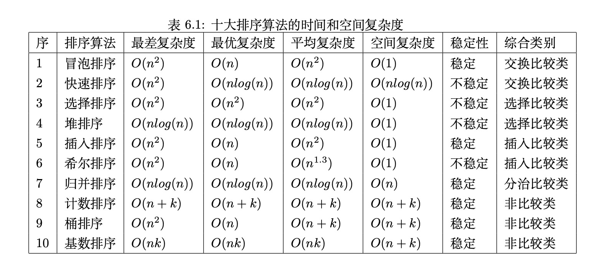
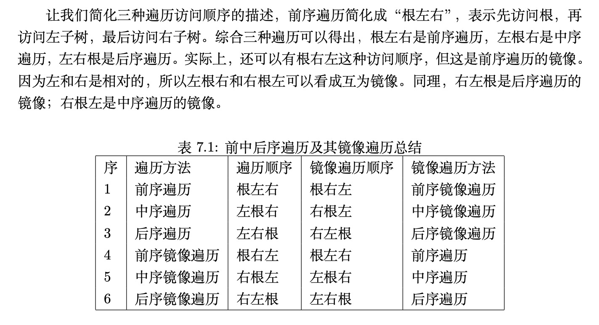

# Rust Algorithms And Data Structures

- 能使用Rust实现完整的程序，包括使用Cargo、rustc、test等
- 能使用基本的数据类型和结构，包括结构体、枚举、循环、匹配
- 能使用Rust范型、生命周期、所有权、指针、unsafe、宏、async
- 能使用内置库crate、外部库，设置Cargo.toml

## 目录

- 计算机科学，计算机科学定义和概念
- 算法分析，理解程序执行时间和空间性能的方法
- 基本数据结构，计算机是一个线性系统，内存也是，基本数据结构保存在内存中。数组，切片，Vec，栈和队列
- 递归
- 查找
- 排序
  - 
- 树，在线性系统上，通过适当的方法也能构造出非线性的数据结构，例如树，通过指针或者饮用用来指向子树。二叉树、二叉搜索树、平衡二叉树、八叉树，B树、B+树、红黑树。
  - 
- 图，邻接表，邻接矩阵等
- 实战，距离算法、字典树、过滤器、缓存淘汰算法、一致性哈希算法，区块链
