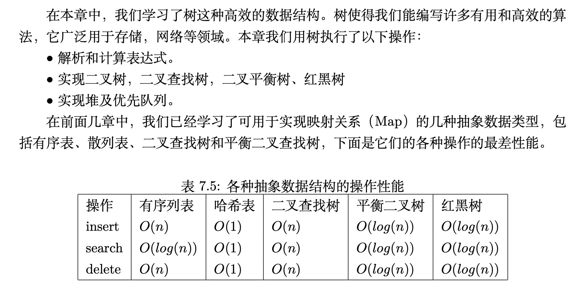

# Rust Algorithms And Data Structures

- 能使用Rust实现完整的程序，包括使用Cargo、rustc、test等
- 能使用基本的数据类型和结构，包括结构体、枚举、循环、匹配
- 能使用Rust范型、生命周期、所有权、指针、unsafe、宏、async
- 能使用内置库crate、外部库，设置Cargo.toml

## 目录

- 计算机科学，计算机科学定义和概念
- 算法分析，理解程序执行时间和空间性能的方法
- 基本数据结构，计算机是一个线性系统，内存也是，基本数据结构保存在内存中。数组，切片，Vec，栈和队列
- 递归
- 查找
- 排序
  - 
- 树，在线性系统上，通过适当的方法也能构造出非线性的数据结构，例如树，通过指针或者饮用用来指向子树。二叉树、二叉搜索树、平衡二叉树、八叉树，B树、B+树、红黑树。
  - 
  - 
- 图，邻接表，邻接矩阵等
  - 广度优先搜索
  - 深度优先搜索
  - 最短路径算法Dijkstra
- 实战，距离算法、字典树、过滤器、缓存淘汰算法、一致性哈希算法，区块链
    - 编辑距离
    - 汉明距离

- 区块链及比特币原理

- 区块链技术是利用链式数据结构来验证与存储数据、利用分布式节点共识算法来生成和更新数据、利用密码学来保证数据传输和访问安全、利用自动化脚本的智能合约来编程和操作数据的一种全新的分布式基础架构和计算范式

- 简单来说，区块链就是去中心化的分布式账本

- 区块链是一个分布式的交易系统：
  - 区块
  - 区块链
  - 交易
  - 账户
  - 矿工
  - 手续费
  - 奖励

- 区块：
  - 区块头，包含前一个区块的哈希pre_hash，当前区块交易哈希tx_hash、区块打包时间time
  - 区块体，包含所有交易transactions
  - 区块哈希，是计算区块头和区块体得到的哈希值