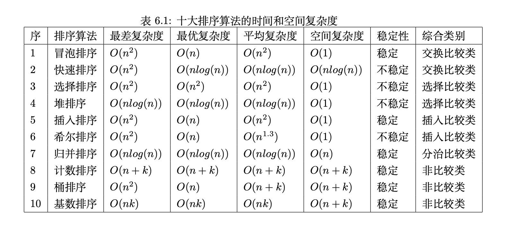

# 排序

- 排序思想
- Rust实现十大基本排序算法

## 啥是排序

- 时间复杂
- 稳定性

- 冒泡排序
- 快速排序
- 选择排序
- 堆排序
- 插入排序
- 希尔排序
- 归并排序
- 计数排序
- 桶排序
- 基数排序

- 鸡尾酒排序
- 梳子排序
- 二分插入排序
- Flash排序
- 蒂姆排序

## 冒泡排序

- 需要多次遍历集合，它比较相邻的项并交换那些无序的项。

- 每次遍历列表都将最大的值放在其正确的位置

- Rust中Vec数据结构默认实现了swap函数，交换操作

- Rust实现冒泡排序

- 时间复杂度 O(n2)

- 添加一个compare变量来控制是否继续比较，在遇到已排序集合时直接退出

- 冒泡排序是从第一个数开始，依次往后比较，相邻的元素两两比较，根据大小来交换元素的位置。
  - 这个过程是单向交换的，只有从左往右。
  - 如果也从右往左冒泡
  - 鸡尾酒排序
  - 时间复杂度还是O(n2)，若序列已经排序，则接近O(n)

- 梳排序
  - 比较间距可以大于1
  - 开始比较间距设定为数组长度，并在循环中以固定的比率递减，通常递减率为1.3
  - 时间复杂度 O(nlogn)
  - 空间复杂度 O(1)
  - 属于不稳定的排序算法

- 冒泡排序还有一个问题：
  - 就是需要合理的安排好边界下标如i,j, i+, j+1，一点都不能错

- 一种2021年发表的不需要出来边界下标值的排序算法
  - 类似插入排序
  - 看起来降序排序，实际是升序排序

## 快速排序

- 快速排序是冒泡排序的升级版

- 快速排序使用分而治之的策略来加快排序速度，和二分思想、递归思想有些类似

- 快速排序步骤：
  1. 选择中枢值
  2. 分区排序

- 中枢应该是在最终排序集合中处于中间或靠近中间的值，这样排序速度才快

- 分区函数partition

- 快速排序需要递归，深度过深性能会下降，在递归深度超过log(n)后作为堆排序
- 在数量少于20时，转为插入排序

- 时间复杂度：O(nlogn)

- 内观排序
- 三区快速排序

## 插入排序

- 通过插入数据项实现排序

- 时间复杂度 O(n2)

- 工作方式：始终在数据集的较低位置处维护一个有序的子序列，然后将新项插入子序列，使子序列扩大，最终实现集合排序

- 二分插入排序

## 希尔排序

- 递减递增排序
- 将原石集合分为多个较小的子集合，然后对每个集合运用插入排序

- 选择子集合是希尔排序的关键

- 增量gap

- 不断调整gap的值，实现排序

- 希尔排序并不比插入排序更好，希尔排序最后一步也是执行了完整的插入排序

- 但是希尔排序减少了插入操作

- 时间复杂度：O(n) ~ O(n2)

## 归并排序

- 分而治之策略提高排序算法性能的另外一种方法，归并排序

- 通过不断将列表折半来进行排序

- 结合递归和合并操作的排序

- 归并排序时，递归分解集合到只有两个元素或一个元素的基本情况，便于直接比较

- 时间复杂度：O(nlog2n)

- 空间复杂度：O(n)

## 选择排序

- 是对冒泡排序的改进，每次遍历集合只做一次交换，为了做到这一点，选择排序在遍历时值寻找最大值的下标，并在完成遍历后，将该最大项交换到正确位置上

- 时间复杂度： O(n2)

- 由于选择排序每轮只进行一次数据交换，所以比冒泡排序更快

## 堆排序

- 堆是一种非线性的完全二叉树，具有以下性质：
  - 每个节点的值都小于或等于其左右孩子节点的值：小顶堆
  - 每个节点的值都大于或等于其左右孩子节点的值：大顶堆

- 堆排序是利用堆数据结构设计的一种排序算法，是一种选择排序，通过不断选择顶元素到末尾，然后再重建堆实现排序

- 时间复杂度：O(nlog2n)

- 不稳定排序

- 不一定非得用链表，用Vec或者数组都能表示堆，其实堆就是类似一堆东西聚合在一起，所以数组或Vec表示的堆比之二叉树结构更贴合堆这个词汇

- 左右子节点： arr[2i] arr[2i+1]

- 大顶堆：arr[i] >= arr[2i] 且 arr[i] >= arr[2i+1]
- 小顶堆：arr[i] <= arr[2i] 且 arr[i] <= arr[2i+1]

- 堆排序基本思想：  将待排序序列构成一个小顶堆，整个序列的最小值就是堆顶跟节点，将其与末尾元素进行交换，此时末尾就为最小值。循环这个过程

## 桶排序

- 不用比较，只要按照数学规律就能自动映射数据到正确位置
  - 桶排序
  - 计数排序
  - 基数排序

- 非比较排序通过确定每个元素之前有多少个元素存在来排序

- 时间复杂度：O(n)

- 占用额外的空间

- 比较排序的优势：适用于各种规模的数据，也不在乎数据的分布
- 非比较排序只适合特殊数据的排序

- 桶和哈希表里的槽类似，槽里只有一个元素，桶里可以有若干元素

- 桶排序的思路：
  1. 第一步，将待排序元素划分到不同的桶，先遍历求出maxV和minV
  2. 设桶个数为k，则把区间[minV, maxV]均匀划分成k个区间
  3. 每个区间就是一个桶，将序列中的元素分配到各自的桶（求余法）
  4. 第二步，对每个桶内的元素进行排序，排序算法可用任意排序算法
  5. 第三步，将各个桶中的有序元素合并成为一个大的有序集合

## 计数排序

- 计数排序是桶排序的特殊情况，它的桶就只能处理同种数据，所以比较费空间

- 基本思路：
  1. 第一步，初始化长度为maxV - minV + 1 的计数器集合，值全为0，其中maxV为待排序集合的最大值，minV为最小值
  2. 第二步，扫描待排序集合，以当前值减少minV作为下标，并对计数器中此下标的计数加1
  3. 第三步，扫描一遍计数器集合，按顺序把值写回原集合，完成排序

## 基数排序

- 利用正数的进制规则来排序，基本是收集分配的思路

- 思路具体：
  1. 第一步，找到nums中最大值，得到位数，将数据统一为相同的位数，不够补零
  2. 第二步，从最低位开始，依次进行稳定排序，收集，再排序高位，直到排序完成

- 基数排序只能处理正数，也要求maxV,minV尽可能接近

## 蒂姆排序

- TimSort

- 高效，稳定且自适应数据分布

- 目前是许多语言的默认排序算法
  - python
  - java
  - rust
  - android

- 是一种混合的排序算法，结合了归并和插入排序

